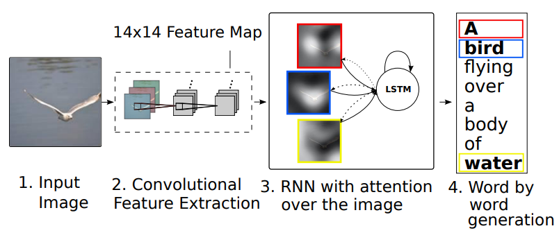

# Paddle-VA-Captioning

## 一、简介
参考论文：《Show, Attend and Tell: Neural Image Caption Generation with Visual Attention》
[论文链接](https://dl.acm.org/doi/10.5555/3045118.3045336)

近年来，人们提出了几种生成图像描述生成方法。这些方法中许多都是基于递归神经网络，并受到了成功使用序列与神经网络进行机器翻译训练的启发。图像描述生成非常适合机器翻译的编码器-解码器框架，一个主要原因是它类似于将图像翻译成句子。

受机器翻译和目标检测工作的启发，论文首次提出在图像描述模型中引入注意力机制，大幅度提高了模型的性能，并可视化展示了注意力机制如何学习将目光固定在图像的显著目标上，整体框架如下。



[参考项目地址链接](https://github.com/ruotianluo/ImageCaptioning.pytorch)

## 二、复现精度
代码在coco2014数据集上训练，复现精度：

Cross-entropy Training

|Bleu_1|Bleu_2|Bleu_3|Bleu_4|METEOR|ROUGE_L|CIDEr|
| :---: | :---: | :---: | :---: | :---: | :---: | :---: |
|0.721|0.547|0.405|0.300|0.242|0.525|0.924|

## 三、数据集
coco2014 image captions [论文](https://link.springer.com/chapter/10.1007/978-3-319-10602-1_48), 采用“Karpathy” data split [论文](https://arxiv.org/pdf/1412.2306v2.pdf)

[coco2014数据集下载](https://aistudio.baidu.com/aistudio/datasetdetail/28191)

- 数据集总大小：123287张
  - 训练集：113287张
  - 验证集：5000张
  - 测试集：5000张
- 标签文件：dataset_coco.json

## 四、环境依赖
paddlepaddle-gpu==2.1.2  cuda 10.2

## 五、快速开始

### step1: 加载数据

预加载训练数据包括: 

通过vgg19提取coco2014图像特征(cocotalk_att_14x14, cocotalk_att_14x14)、cocotalk.json、cocotalk_label.h5

生成网格特征cocotalk_att_14x14、池化特征cocotalk_fc_14x14
```bash
python scripts/prepro_feats.py
```

生成cocotalk_label.h5和cocoktalk.json文件
```bash
python scripts/prepro_labels.py
```

加载以上数据文件后放在本repo的data/下 

可以直接[加载上述预训练数据](https://aistudio.baidu.com/aistudio/datasetdetail/106948)

**Install dependencies**
```bash
pip install -r requestments.txt
```

### step2: 训练

```bash
python3 train.py
```

### step3: 验证评估

验证模型
```bash
python eval.py
```

测试时程序会加载本repo的log/下保存的训练模型数据。

可以[下载训练好的模型数据](https://aistudio.baidu.com/aistudio/datasetdetail/107076), 放到本repo的log/下，然后直接执行验证指令。

## 六、代码结构与参数说明

### 6.1 代码结构

```
├─config                          # 配置
├─models                          # 模型
├─misc                            # 训练测试工具
├─data                            # 训练数据目录
├─scripts                         # 预处理文件
│  eval.py                        # 评估
│  dataloader.py                  # 数据加载器
│  README.md                      # readme
│  requirements.txt               # 依赖
│  train.py                       # 训练
```
### 6.2 参数说明

可以在config文件中设置训练与评估相关参数

## 七、模型信息

关于模型的其他信息，可以参考下表：

| 信息 | 说明 |
| --- | --- |
| 发布者 | Lieber |
| 时间 | 2021.10 |
| 框架版本 | Paddle 2.1.2 |
| 应用场景 | 多模态 |
| 支持硬件 | GPU、CPU |
| 下载链接 | [最优模型](https://aistudio.baidu.com/aistudio/datasetdetail/107076)|
| 在线运行 | [notebook](https://aistudio.baidu.com/aistudio/projectdetail/2338889)|
